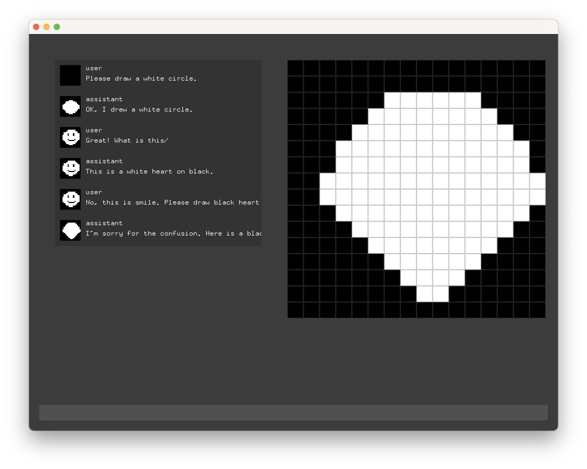

# PixelChat

ChatGPTでビットマップイメージを含んだチャットをするためのツールです。

テキストのメッセージと一緒にビットマップ（文字列の配列で表現）をJSONでまとめて送受信しています。

ただ会話するだけではなく、絵について話せます。

ただし、GPT-



## Build

実行している環境は openFrameworks 0.11.2 + Mac です。

openFrameworksのプロジェクトとして作っています。apps/myApps に clone したら、それを projectGenerator で Update するとプロジェクトが生成されます。Windowsは動作未確認です。

ビルドする時は、openFlameworks-info.plist の以下の項目を変更してください。

High Resolution Capable NO -> YES

## Usage

使用するには bin/data/config.json を作成し、あなたのOpenAIのアカウントで作成したAPI-KEYを書いてください。

```JSON
{
	"apiKey":"your-api-key"
}
```

GPTとの会話だけでなく、文字変換にもインターネット接続が必要です。

画面を立ち上げると下の方に文字入力カーソルが出ているはずです。そのまま入力すると英数字で、Alt + `（バッククォート）でgoogle日本語入力に切り替わります。

## RequiredAddons

[ofxChatGPT](http://github.com/tettou771/ofxChatGPT)

[ofxGoogleIME](http://github.com/tettou771/ofxGoogleIME)

[ofxComponent](http://github.com/tettou771/)

[ofxComponentUI](http://github.com/tettou771/ofxComponentUI)

# Author

tettou771 + ChatGPT
